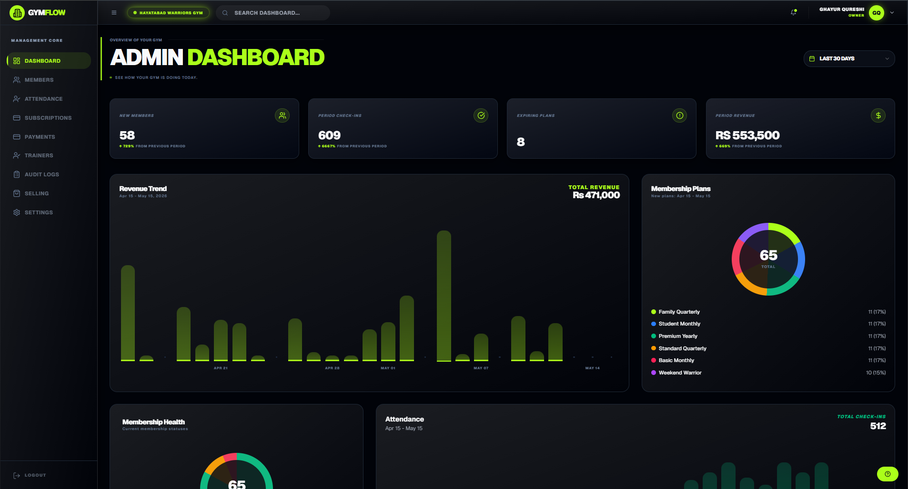

# GMS SaaS - Gym Management System

A production-ready, multi-tenant Gym Management SaaS engineered to streamline operations for fitness centers. Built with Next.js 16 (App Router), TypeScript, and MongoDB, this platform provides granular role-based access, comprehensive member management, and real-time financial tracking.



## Overview

GMS SaaS is designed to solve real-world operational challenges for gym owners. As a multi-tenant application, it allows a single deployment to host isolated environments for multiple gyms. The architecture focuses on strict data separation, high performance, and an intuitive user experience. 

This project demonstrates scalable architecture, robust state management, and modern UI/UX principles, making it an excellent reference for enterprise-grade SaaS development and business solutions.

## Core Capabilities

- **Multi-Tenant Architecture**: Complete data isolation and independent management for multiple gym entities on a single platform instance.
- **Granular Role-Based Access Control (RBAC)**: Distinct permissions and tailored dashboards for Owners, Managers, Trainers, and Receptionists.
- **Member & Attendance Management**: End-to-end member lifecycle tracking, including subscription status, detailed profiling, and QR-based automated check-ins.
- **Financial Analytics**: Real-time revenue tracking, payment recording, and platform-level financial dashboards for actionable business insights.
- **Workout & Fitness Planning**: Dedicated tools for trainers to create exercise templates and assign customized workout routines to members.

## Technical Stack

**Frontend & Framework**
- Next.js 16 (App Router)
- React 19
- TypeScript
- Tailwind CSS 4
- Radix UI & shadcn/ui for accessible, high-quality components
- Zustand for predictable state management
- Recharts for data visualization

**Backend & Database**
- Next.js API Routes (Serverless architecture)
- MongoDB with Mongoose ODM
- NextAuth.js for secure, session-based authentication
- Stripe (Prepared for service integration)

## Getting Started

### Prerequisites
- Node.js 18.0+
- MongoDB instance (Local or Atlas)
- npm or pnpm

### Installation & Setup

1. **Clone the repository**
   ```bash
   git clone https://github.com/Khubaib-shah/GMS-saas.git
   cd GMS-saas
   ```

2. **Install dependencies**
   ```bash
   npm install
   ```

3. **Configure Environment**
   Create a `.env` file in the root directory based on `.env.example`:
   ```env
   MONGODB_URL=your_mongodb_connection_string
   NEXTAUTH_SECRET=your_nextauth_secret
   NEXTAUTH_URL=http://localhost:3000
   ```

4. **Seed the Database**
   To easily test the application with localized data and multiple roles:
   ```bash
   npm run seed
   ```
   *Note: This command generates a `seed_pakistani_credentials.json` file containing ready-to-use test accounts for different roles.*

5. **Start Development Server**
   ```bash
   npm run dev
   ```

## Project Architecture

- `/app`: Next.js App Router containing all page layouts, routing, and API endpoints.
- `/components`: Reusable, modular UI components utilizing Tailwind and shadcn/ui.
- `/lib`: Core business logic, services, utilities, and database connection logic.
- `/models`: Mongoose database schemas defining the application's data layer.
- `/scripts`: CLI tools for database administration and data seeding.
- `/types`: Shared TypeScript definitions enforcing type safety across the stack.

## License & Contact

Proprietary. All rights reserved. 

For business inquiries, licensing, or freelance development opportunities, please reach out directly through GitHub.
